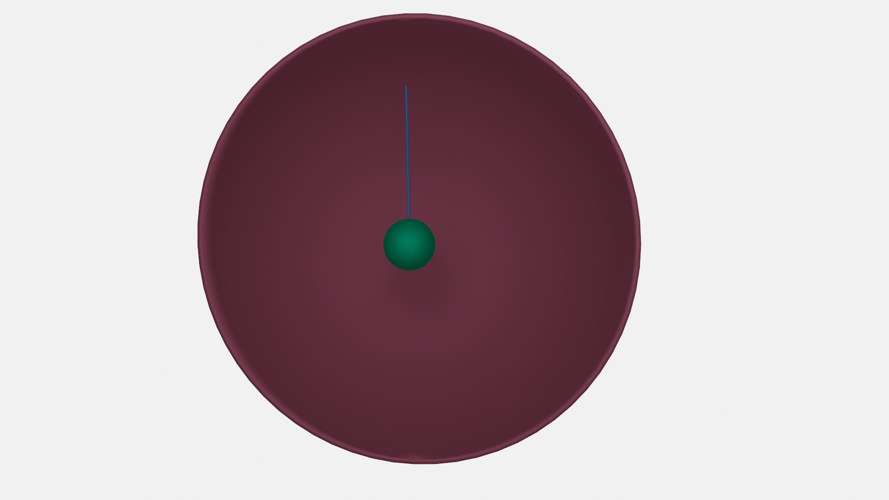
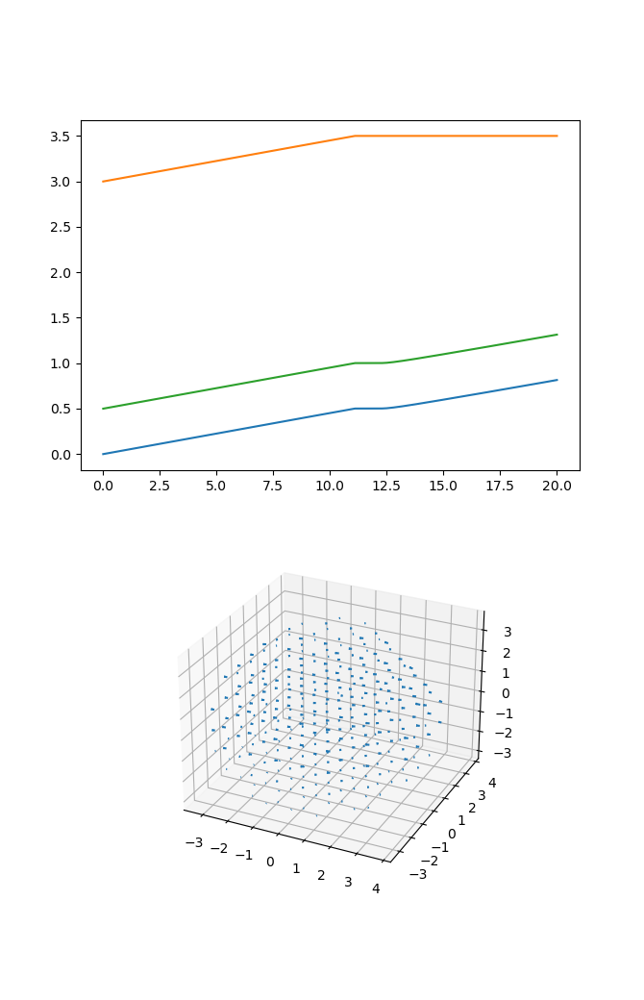

.. _getting-started:

Getting started
===============

While there are a lot of complicated components to :obj:`SkellySim`, the basic workflow is
easy.

1. :ref:`Generate a configuration file<generating-configuration-files>`

   :code:`$ python gen_config.py`
2. Generate precompute data

   :code:`$ skelly_precompute`
3. Run the simulation. Recommended in an :code:`sbatch` script. See `example submission script
   <https://github.com/flatironinstitute/SkellySim/tree/main/examples/skelly_sim_slurm_sbatch.sh>`_

   :code:`$ mpirun skelly_sim`
4. :ref:`Visualize<visualization>` or :ref:`post-process<post-processing>`

Example simulation full workflow
--------------------------------

The following `example
<https://github.com/flatironinstitute/SkellySim/tree/main/examples/body_fiber_periphery_constant_body_force>`_
is from our github. It represents a fairly minimal system which has a Fiber attached to a Body
and a Periphery. The Body experiences a constant upward force, while the Fiber attaches and
hinges to the Periphery when it gets close to it. For more details about the actual
configuration generation process, you should check out :ref:`generate a configuration
file<generating-configuration-files>`. If you're using :obj:`singularity`, which we recommend
to start with, note you'll have to prefix all your commands as noted in the :ref:`installation`
page. Now, before we get into how to generate images, let's show what this initial condition
looks like

Download the `example
<https://github.com/flatironinstitute/SkellySim/tree/main/examples/body_fiber_periphery_constant_body_force/gen_config.py>`_
and put in a clean directory.

.. code-block::

    % ls
    gen_config.py
    % ./gen_config.py
    Using default toml file for output: 'skelly_config.toml'. Provide an alternative filename argument to this script to use that instead.
    % ls
    gen_config.py skelly_config.toml

The config generation scripts we provide all default to making a 'skelly_config.toml' file,
though this naming isn't necessary. Your script can name the file whatever it likes, though
using this default is nice since most scripts look for it. It's also worth taking a look at the
output just to see what's inside, though there isn't really much reason to peer into them
unless you want to make a quick change to see what a parameter does.

The next step is to generate some precompute data which is used throughout the simulations
(quadrature weights and matrix inversions). Use the :obj:`skelly_precompute` utility to do
this. If you're using a virtual environment or conda for the python portion, make sure to
activate that environment first. Note that this can take some time, especially if your
:obj:`Periphery` has a lot of nodes.

.. code-block::

    % skelly_precompute
    {'nucleation_type': 'auto', 'n_nucleation_sites': 50, 'position': [0.0, 0.0, 0.0], 'orientation': [0.0, 0.0, 0.0, 1.0], 'shape': 'sphere', 'radius': 0.5, 'n_nodes': 400, 'precompute_file': 'body_precompute.npz', 'external_force': [0.0, 0.0, 0.5]}
    Building Quadrature Weights
    Finished building Quadrature Weights
    Building Quadrature Weights
    Finished building Quadrature Weights
    Creating periphery object
    Finished creating periphery object
    Finished periphery init.
    % ls
    body_precompute.npz  gen_config.py  periphery_precompute.npz  skelly_config.toml

Now we have all our configuration and precompute data and are ready to run a simulation. Since
this is a very basic simulation, there is no need to use mpirun, which will likely hinder more
than help performance. When simulating thousands of fibers or giant Peripheries, mpirun becomes
necessary. You may see some warnings about OpenMP from Kokkos. You can ignore the warning or do
as it recommends. It may or may not help performance.

Run the simulation as follows. Then maybe go get a cup of coffee, as it should take a few minutes.

.. code-block::

    % skelly_sim
    [2022-03-28 16:04:06.968] [SkellySim] [info] ****** SkellySim 0.9.3 (a5a5baae) ******
    [2022-03-28 16:04:06.971] [SkellySim] [info] Preprocessing config file
    [2022-03-28 16:04:06.972] [SkellySim] [info] Initializing FiberContainer
    [2022-03-28 16:04:08.645] [SkellySim] [info] Reading in 1 fibers.
    [2022-03-28 16:04:10.706] [SkellySim] [info] Loading raw precomputation data from file periphery_precompute.npz for periphery into rank 0
    [2022-03-28 16:04:11.032] [SkellySim] [info] Done initializing base periphery
    [2022-03-28 16:04:14.660] [SkellySim] [info] Reading in 1 bodies
    [2022-03-28 16:04:14.737] [SkellySim] [info] Body 0: [ 0, 0, 0 ]
    [2022-03-28 16:04:15.691] [SkellySim] [info] Solver converged with parameters: iters 7, time 0.3280859529040754, achieved tolerance 4.6319964036583045e-11
    [2022-03-28 16:04:15.731] [SkellySim] [info] Residual: 1.824888062028897e-07
    [2022-03-28 16:04:15.731] [SkellySim] [info] Accepting timestep and advancing time
    [2022-03-28 16:04:15.732] [SkellySim] [info] System time, dt, fiber_error: 0.1, 0.1, 2.0501852452392555e-06
    etc...
    % ls
    body_precompute.npz  gen_config.py  periphery_precompute.npz  skelly_config.toml  skelly_sim.out

We now have one more file 'skelly_sim.out'. This is the trajectory information. This contains
all solution information at all output times in a binary nested dictionary format
:obj:`msgpack` (which is similar to :obj:`json`).

To visualize this, you should be able to open it with our provided :obj:`.blend` file (just
make sure to put the :obj:`skelly_blend.py` script with it in the same directory. This process
isn't standardized yet unfortunately). By default these are both in the `source scripts
<https://github.com/flatironinstitute/skellysim/scripts>`_ directory. This doesn't need the
:obj:`Singularity` container or any install at all. Just the 'skelly.blend' and
'skelly_blend.py' files. The first time the script is run it should bootstrap itself to work
with :obj:`Blender`'s packaged :obj:`Python`.

.. code-block::

    % blender  ~/projects/codes/SkellySim/scripts/skelly.blend -y

Will open :obj:`Blender`, find the simulation, and set up a scene and animation for it. Just
make sure to run it from the simulation directory. Also, note the '-y' option, which allows
:obj:`Blender` to execute scripts, which our setup depends on. Otherwise you'll have to click a
dialog menu.

If you'd like to animate it, you can use the standard gui facilities, or you can run :obj:`Blender` in batch mode.

.. code-block::

    % blender  ~/projects/codes/SkellySim/scripts/skelly.blend -y -b -o movie -F AVIRAW -a

will generate a very very large AVI file in your simulation directory (likely named
movie0000-0199.avi) in this specific case. If you have a working :obj:`ffmpeg` install (or
another utility of your choice), you can compress this by a few orders of magnitude without
real loss of quality.

.. code-block::

    % ffmpeg -y -r 60 -i movie0000-0199.avi -vcodec libx264 -crf 10 -r 60 movie.mp4

.. raw:: html

   <video controls width=600 src="_static/example.mp4"></video>

Now we probably want to do some analysis. The following code loads in a trajectory and plots vs
time the 'z' coordinates of the body, the fiber plus end, and the fiber minus end in the
:obj:`body_fiber_periphery_constant_body_force` example. It also generates a 3d quiver plot of
the velocity field at the 11th time frame of the velocity field. The full code is in the
:obj:`examples/analysis_example.py` script.

.. highlight:: python
.. code-block:: python

    import numpy as np
    import matplotlib
    matplotlib.use('TKAgg')
    import matplotlib.pyplot as plt

    from skelly_sim.reader import TrajectoryReader, Listener, Request

    traj = TrajectoryReader('skelly_config.toml')
    shell_radius = traj.config_data['periphery']['radius']
    body_radius = traj.config_data['bodies'][0]['radius']

    body_pos = np.empty(shape=(len(traj), 3)) # COM body position in time
    plus_pos = np.empty(shape=(len(traj), 3)) # fiber plus end in time
    minus_pos = np.empty(shape=(len(traj), 3)) # fiber minus end in time

    for i in range(len(traj)):
        traj.load_frame(i)
        body_pos[i, :] = traj['bodies'][0]['position_']
        minus_pos[i, :] = traj['fibers'][0]['x_'][0, :]
        plus_pos[i, :] = traj['fibers'][0]['x_'][-1, :]

    print("system keys: " + str(list(traj.keys())))
    print("fiber keys: " + str(list(traj['fibers'][0].keys())))
    print("body keys: " + str(list(traj['bodies'][0].keys())))
    print("shell keys: " + str(list(traj['shell'].keys())))

    ax1 = plt.subplot(1, 2, 2)
    ax1.plot(traj.times, body_pos[:, 2], traj.times, plus_pos[:,2], traj.times, minus_pos[:,2])

    # Fire up SkellySim in "listener" mode
    listener = Listener(binary='skelly_sim_release')

    # All analysis requests are done via a "Request" object
    req = Request()

    # specify frame number to evaluate and evaluator (CPU, GPU, FMM)
    req.frame_no = 11
    req.evaluator = "GPU"
                
    # Request velocity field
    tmp = np.linspace(-shell_radius, shell_radius, 20)
    xm, ym, zm = np.meshgrid(tmp, tmp, tmp)
    xcube = np.array((xm.ravel(), ym.ravel(), zm.ravel())).T

    # Filter out points outside periphery and inside body
    relpoints = np.where((np.linalg.norm(xcube - body_pos[11,:], axis=1) > body_radius) &
    (np.linalg.norm(xcube, axis=1) < shell_radius))
    req.velocity_field.x = xcube[relpoints]
    
    # Make our request to SkellySim! Might take a second...
    res = listener.request(req)

    x = req.velocity_field.x
    v = res['velocity_field']

    ax2 = plt.subplot(1, 2, 2, projection="3d")
    ax2.quiver(x[:, 0], x[:, 1], x[:, 2], v[:, 0], v[:, 1], v[:, 2])

    plt.show()

.. code-block::

    % python ../analysis_example.py
    Loading trajectory index.
    Loading trajectory index.
    Stale trajectory index file. Rebuilding.
    system keys: ['time', 'dt', 'rng_state', 'fibers', 'bodies', 'shell']
    fiber keys: ['n_nodes_', 'length_', 'length_prev_', 'bending_rigidity_', 'penalty_param_', 'force_scale_', 'beta_tstep_', 'epsilon_', 'binding_site_', 'tension_', 'x_']
    body keys: ['radius_', 'position_', 'orientation_', 'solution_vec_']
    shell keys: ['solution_vec_']

   
