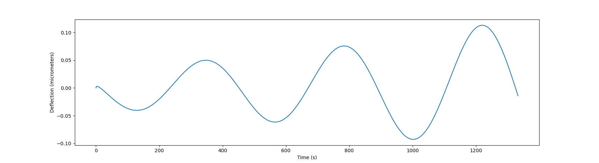

Test for a single clamped fiber with a constant force per unit length toward the clamping
point. Values of `sigma < 76` should have decaying fiber oscillations, and values of `sigma >
76` should have growing oscillations. The python script, when run in either subdirectory, will
plot the `x` position of the unclamped end of the fiber.

Credit: Brato Chakrabarti for the [derivation](hopf-bifurcation.pdf)

